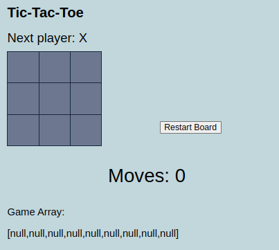

# Tic-Tac-Toe Game

[DEPLOYED VERSION](https://tic-tac-toe-jg0j.onrender.com/)

## Description

Tic-Tac-Toe is a classic game where two players take turns marking spaces in a 3x3 grid. The player who succeeds in placing three of their marks in a horizontal, vertical, or diagonal row wins the game.

This project is a simple implementation of the Tic-Tac-Toe game using React. It features a clean and intuitive user interface, making it easy for players of all ages to enjoy.

## Features

- Simple and intuitive user interface
- Game logic implemented in React
- Ability to restart the game
- Displays the current player's turn
- Announces the winner when the game is over

## Installation

1. Clone the repository:
git clone https://github.com/sireme/tic-tac-toe.git

2. Navigate to the project directory:
cd tic-tac-toe

3. Install dependencies:
npm install

4. Start the development server:
npm start

## Usage

1. Open your browser and navigate to `http://localhost:3000`.
2. Click on a square to place your mark.
3. The game will automatically switch turns between players.
4. The game will announce the winner when a player has three marks in a row, column, or diagonal.

## Contributing

Contributions are welcome! Please read the [contributing guidelines](./CONTRIBUTING.md) before getting started.

## License

This  project is licensed under the MIT License - see the [LICENSE](./LICENSE) file for details.

## Contact

If you have any questions, issues, or suggestions, feel free to open an issue on GitHub or contact the project maintainer directly.

## Acknowledgments

- React for providing a powerful and flexible framework for building user interfaces.
- The Tic-Tac-Toe game community for inspiration and feedback.
